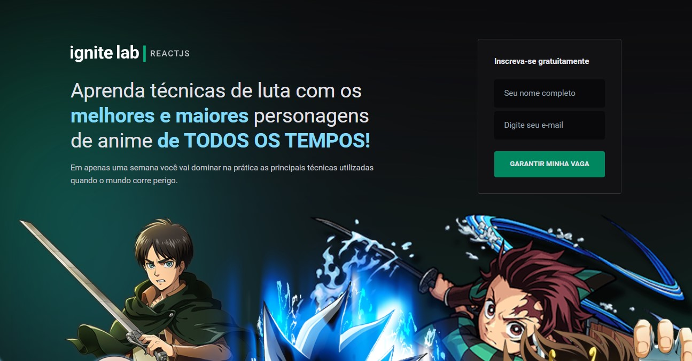
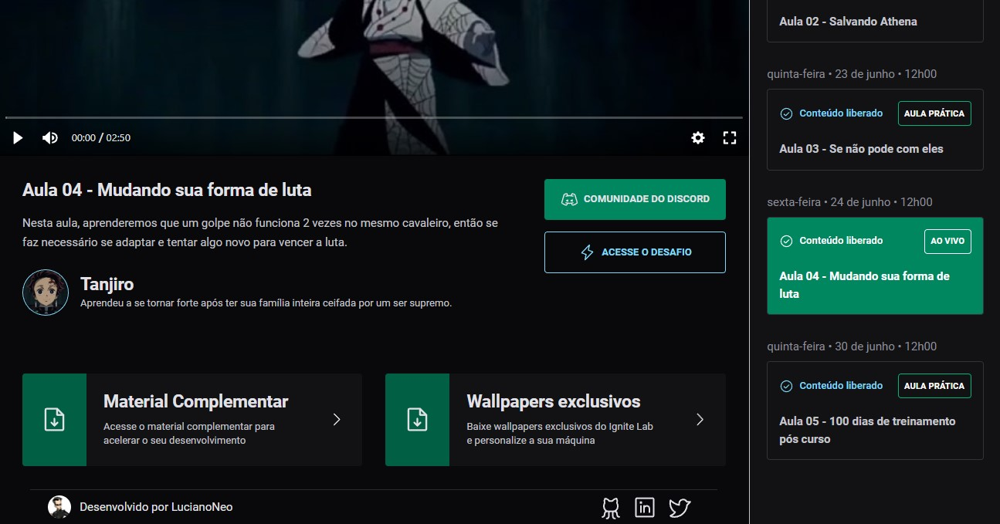
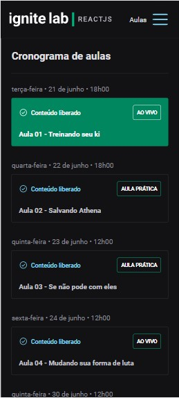
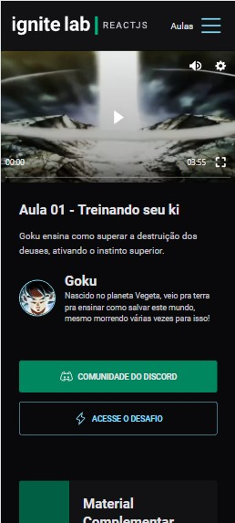

# Anime-Lessons

 
 

Projeto desenvolvido durante o evento Ignite-Lab02 da RocketSeat.  
Se trata de uma plataforma de aulas/eventos desenvolvida com as tecnologias:

Projeto hospedado e rodando na 

## Adições pós evento
- Rodapé
- personalização do tema para liçoes dos animes
- responsividade
