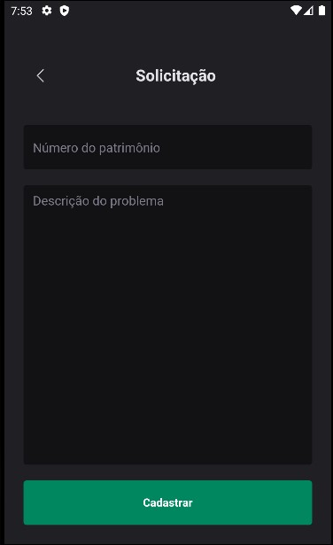

# ROCKET HELP
Projeto desenvolvido em ReactNative, se trata de um aplicativo para abertura, acompanhamento e fechamento de chamados técnicos.

Detalhes técnicos:

- Aplicativo desenvolvido com expo + react native.
- Utiliza a biblioteca NATIVE BASE e PHOSPHOR ICONS para montagem e estilização dos componentes.
- React Navigation para troca de telas/páginas
- Faz a autenticação do usuário através do FIREBASE AUTHENTICATION, e a gravação e consulta de dados através do FIREBASE FIRESTORE.